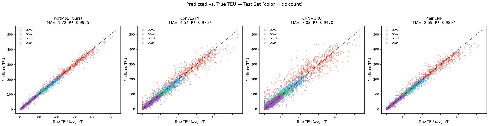
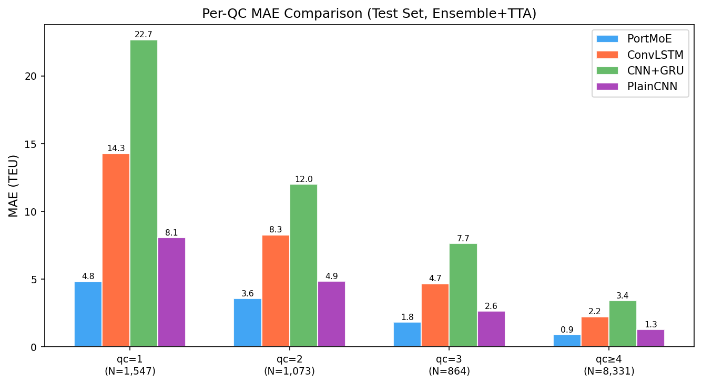
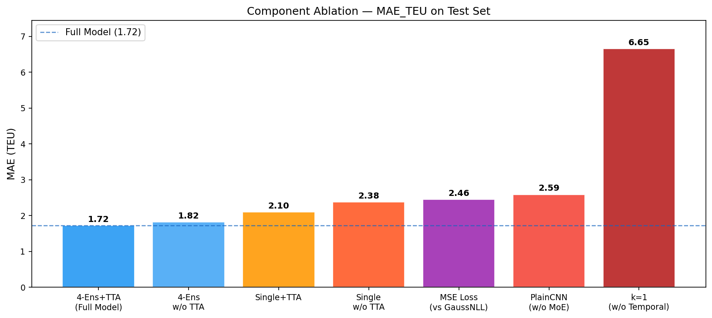

# PortMoE: Mixture-of-Experts CNN for Port QC Efficiency Prediction

A deep learning framework for predicting container throughput efficiency of quay cranes (QC) in port yards, achieving **MAE = 1.72 TEU** and **R² = 0.9955** on a real-world dataset of 118,080 operation records.

---

## Overview

Port terminal operators need accurate QC efficiency forecasts to optimize berth scheduling and resource allocation. Existing approaches rely on tabular statistics or simple recurrent models that ignore the **spatio-temporal structure** of yard occupancy.

We propose **PortMoE**, a convolutional Mixture-of-Experts architecture that:
- Encodes the 3-D yard snapshot tensor (bays × rows × tiers) with a **PortCNNPlus** backbone
- Stacks **k=2 temporal frames** to capture short-horizon dynamics
- Routes predictions through **4 expert heads** via learned gating conditioned on hour-of-day and QC count
- Trains with **heteroscedastic Gaussian NLL loss** for automatic uncertainty-aware sample weighting
- Evaluates under **file-level (voyage-level) split** to eliminate data leakage

---

## Results

### Comparison with Baselines (4-Ens + TTA)

| Model | MAE (TEU) | RMSE | R² |
|:--|---:|---:|---:|
| **PortMoE (Ours)** | **1.72** | **4.48** | **0.9955** |
| PlainCNN | 2.59 | 7.18 | 0.9897 |
| ConvLSTM | 4.54 | 11.24 | 0.9757 |
| CNN+GRU | 7.03 | 16.87 | 0.9470 |

All differences are statistically significant (Wilcoxon signed-rank test, *p* < 10⁻³⁰⁰, *N* = 11,815).

### Component Ablation

| Variant | MAE (TEU) | Δ vs Full |
|:--|---:|---:|
| **Full Model** (4-Ens+TTA) | **1.72** | — |
| w/o TTA (4-Ens only) | 1.82 | +6% |
| Single model + TTA | 2.10 | +22% |
| MSE Loss (vs GaussNLL) | 2.46 | +43% |
| w/o MoE (PlainCNN) | 2.59 | +50% |
| k=1 (w/o Temporal) | 6.65 | +286% |

### Per-QC MAE

| QC Count | N | PortMoE | ConvLSTM | CNN+GRU | PlainCNN |
|:--|---:|---:|---:|---:|---:|
| qc=1 | 1,547 | **4.8** | 14.3 | 22.7 | 8.1 |
| qc=2 | 1,073 | **3.6** | 8.3 | 12.0 | 4.9 |
| qc=3 | 864 | **1.8** | 4.7 | 7.7 | 2.6 |
| qc≥4 | 8,331 | **0.9** | 2.2 | 3.4 | 1.3 |

---

## Model Architecture

```
Input: (B, 12, 7, 22)   ← k=2 temporal frames × 6 channels stacked
        │
   PortCNNPlus Backbone  ← stem_ch=48, stage_ch=64, ~309K params
        │
   Global Average Pool   → feature vector (64-d)
        │
   MoE Gating Network    ← conditioned on hour emb + qc_count emb
   (K=4 experts, softmax)
        │
   Expert Heads × 4      ← FC(64→64→2), outputs (μ, log σ)
        │
   Weighted Mean          → final (μ_teu, μ_move)

Loss: Heteroscedastic Gaussian NLL
```

---

## Dataset

- **118,080** operation records from **2,862** voyage files
- Input tensor shape: `(6, 7, 22)` — 6 time steps × 7 rows × 22 bays
- Targets: average TEU throughput + average move count per QC-hour
- **File-level split** (no leakage): train=2,289 / val=286 / test=287 files

> `processed_data.pt` (420 MB) is tracked via Git LFS.

---

## Repository Structure

```
├── model.py                        # PortMoE model definition
├── models.py                       # Baseline models (ConvLSTM, CNN+GRU, PlainCNN)
├── train.py                        # Single-seed training script
├── preprocess.py                   # Raw xlsx → processed_data.pt
├── hetero_ensemble_v6_filesplit.py # Main training: file-level split, multi-seed
├── baseline_comparison.py          # Baseline training
├── ablation_temporal_k.py          # Temporal k ablation (k=1~5)
├── component_ablation.py           # Component ablation (MSE loss variant)
├── plot_scatter.py                 # Figures + Wilcoxon statistical tests
├── processed_data.pt               # Preprocessed dataset (Git LFS)
└── experiments/
    ├── ablation-temporal-k2/       # Best model checkpoints (4 seeds)
    ├── baseline-*/                 # Baseline checkpoints
    ├── ablation-*/                 # Ablation checkpoints
    ├── figures/                    # Generated plots
    └── *.json                      # Experiment result logs
```

---

## Quick Start

### Requirements

```bash
pip install torch torchvision numpy pandas scipy matplotlib openpyxl
```

### Inference (pretrained)

```python
import torch
from model import PortMoEv2Hetero

device = torch.device("cuda" if torch.cuda.is_available() else "cpu")

# Load any of the 4 seed checkpoints
ckpt = torch.load("experiments/ablation-temporal-k2/seed_42/best.pt", map_location=device)
model = PortMoEv2Hetero(in_ch=12).to(device)
model.load_state_dict(ckpt["model"])
model.eval()
```

### Reproduce All Experiments

```bash
# 1. Preprocess raw data
python preprocess.py

# 2. Train PortMoE (4 seeds, file-level split, k=2)
python hetero_ensemble_v6_filesplit.py

# 3. Train baselines
python baseline_comparison.py

# 4. Component ablation
python component_ablation.py

# 5. Generate figures + statistical tests
python plot_scatter.py
```

---

## Figures

| Scatter (Pred vs True) | Per-QC MAE | Ablation |
|:---:|:---:|:---:|
|  |  |  |

---

## Citation

> Work in progress. Paper to be submitted.

---

## License


Jiajun CAO
